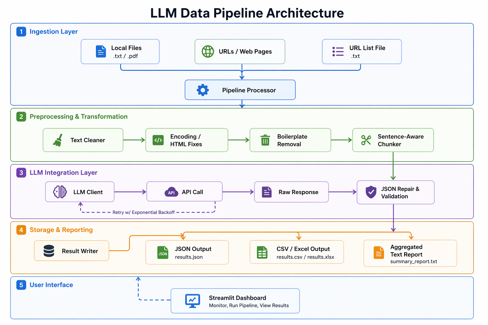

# LLM Integration & Data Pipeline

## Overview
A robust, production-style data pipeline that integrates with LLM APIs, handles real-world messy input, and produces clean structured output without relying on high-level abstraction libraries like LangChain or LlamaIndex.

## Features
- Modular Python architecture with clear separation of concerns.
- Ingestion of `.txt` and `.pdf` files and multiple URLs in a single run.
- Sentence-aware character-based chunking with context overlap.
- Direct LLM API calls with custom retry logic and exponential backoff.
- Malformed JSON repair and validation from LLM outputs.
- Structured storage in JSON, CSV, and Excel formats.
- Aggregated plain-text summary reporting.

## Architecture


## Project Structure
```text
llm-pipeline-assignment/
├── app/
│   ├── config.py
│   ├── logger.py
│   ├── models.py
│   ├── utils/
│   │   ├── chunking.py
│   │   └── json_utils.py
│   ├── ingestion/
│   │   ├── file_loader.py
│   │   ├── pdf_loader.py
│   │   └── url_loader.py
│   ├── preprocessing/
│   │   ├── cleaner.py
│   │   └── boilerplate.py
│   ├── llm/
│   │   ├── client.py
│   │   ├── prompts.py
│   │   └── parser.py
│   ├── pipeline/
│   │   └── runner.py
│   └── output/
│       └── writer.py
├── assets/
│   └── Architecture.png
├── sample_inputs/
│   ├── sample1.txt
│   ├── sample1.pdf
│   └── urls.txt
├── sample_outputs/
│   ├── results.json
│   ├── results.csv
│   └── summary_report.txt
├── tests/
├── .env.example
├── .gitignore
├── main.py
├── requirements.txt
├── README.md
└── LICENSE
```

## Setup
1. Create a virtual environment: `python -m venv .venv`
2. Activate it: `.venv\Scripts\activate` (Windows) or `source .venv/bin/activate` (Linux/macOS)
3. Install dependencies: `pip install -r requirements.txt`

## Environment Variables
Create a `.env` file (see `.env.example`) and add your keys:
- `LLM_PROVIDER`: `groq` or `openai`
- `GROQ_API_KEY`: Your Groq API key
- `OPENAI_API_KEY`: Your OpenAI API key
- `MODEL_NAME`: e.g., `llama-3.1-8b-instant`

## How to Run
Run the pipeline using the root `main.py` script. You can provide files and URLs as arguments.

## Example Command
```bash
python main.py --files sample_inputs/sample1.txt sample_inputs/sample1.pdf --urls https://example.com
```

## Output Files
- **JSON:** `sample_outputs/results.json` (Structured extraction)
- **CSV:** `sample_outputs/results.csv` (Tabular format)
- **Report:** `sample_outputs/summary_report.txt` (Aggregated findings)

## Design Decisions
- **Direct API Calls:** Used `httpx` to demonstrate control over the LLM request lifecycle without "black-box" libraries.
- **Case-Preserving Cleaner:** The custom cleaner removes boilerplate while maintaining casing, which is essential for named entity recognition.
- **Modular Loaders:** Separated File and PDF loaders for maintainability and scalability.

## Failure Handling
- **API Retries:** Uses `tenacity` for exponential backoff on timeouts and rate limits (429).
- **Graceful Skipping:** Problematic files or chunks are logged and skipped, ensuring the entire batch isn't aborted.
- **JSON Repair:** Automatically strips markdown fences and repairs trailing commas before parsing.

## Tested Inputs
- `sample1.txt`: Long-form technical news content.
- `sample1.pdf`: Multi-page report with varied layouts.
- `https://example.com`: Simple static web content.

## Known Limitations
- Does not handle JavaScript-heavy websites (static HTML only).
- PDF extraction quality depends on the underlying text layer.
- Character-based chunking is a fallback for token-aware chunking.

## Why This LLM API
I used the **Groq API** with the `llama-3.1-8b-instant` model because of its exceptional inference speed and OpenAI-compatible interface, allowing for a robust demo that is fast and cost-effective.

## Demo Video
**[Link to Demo Video](https://drive.google.com/file/d/1zlaKACeidzTVIIWe-jNAYR40cN3-CSVL/view?usp=sharing)**
